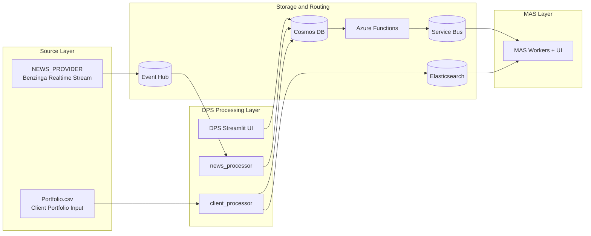

# SMIF

## v1.1 Checklist
- move modules' config to app/common and refactor docker services to use this path in bind mount [x]
- move `Client` indexing and upsert from MAS module to DPS module [x]
- Create proper model schemas for `Client` and `News` in DPS [x]
- Revise search.py in MAS module [x]
- Revise news_poller.py to use Benzinga realtime news wss api to poll news stream [x]

## Changes Since `origin/v1.1`

Remote branch tip: `f1ef0b2` on `origin/v1.1`  
Local branch tip: `83e1e76` on `v1.1`

Commits included in this local delta:

- `f669084` `feat(v1.1): add DPS news lifecycle dashboard and MAS portfolio view`
- `dd90cbe` `feat(v1.1): add functions app and split DPS processing services`
- `83e1e76` `refactor(v1.1): remove MAS portfolio bootstrap and simplify client matching`

Net result of those commits:

- DPS is split into dedicated responsibilities for UI, realtime news processing, and client portfolio processing.
- Realtime ingestion now starts from the Benzinga websocket-backed `NEWS_PROVIDER` service instead of the old `news_poller.py` script.
- Azure Functions responsibilities now live under `src/app/functions` and cover both change-feed dispatch and delayed standard job scheduling.
- Standard workflow dispatch now targets `delayed-news-events`.
- MAS no longer builds or indexes portfolio data at startup; it consumes portfolio documents already produced by DPS.

v1.1 flow after the local commits:



## Description

SMIF is an event-driven market insight system for ingesting news, storing normalized market data, matching relevant news against client portfolios, and generating client-facing insights.

The current local stack is organized around four runtime areas:

- `DPS` owns client portfolio processing, news normalization, and the Streamlit operator UI.
- `functions` hosts the Azure Functions app used for Cosmos change-feed dispatch and delayed standard workflow scheduling.
- `NEWS_PROVIDER` maintains the realtime Benzinga websocket listener and publishes raw events into Event Hub.
- `MAS` consumes workflow queues, matches news against indexed client portfolios, and stores generated insights.

## Current Architecture

```text
NEWS_PROVIDER
  -> Benzinga websocket stream
  -> Event Hub: news-stream

DPS news_processor
  -> consume Event Hub: news-stream
  -> normalize raw news
  -> Cosmos DB news container

Azure Functions change_feed_service
  -> consume Cosmos DB change feed
  -> Service Bus queue: realtime-news-events

Azure Functions standard_trigger
  -> schedule Service Bus queue: delayed-news-events

DPS client_processor
  -> load portfolio source
  -> build client portfolio documents
  -> Cosmos DB client portfolio container
  -> Elasticsearch client index

MAS queue consumers
  -> HNW workflow for realtime_news
  -> Standard workflow for standard_news
  -> generate_insight events
  -> Cosmos DB insights container
  -> MAS Streamlit UI
```

Current routing behavior:

- raw realtime news enters through `NEWS_PROVIDER` and is published into Event Hub `news-stream`
- DPS `news_processor` consumes `news-stream`, normalizes documents, and writes them into Cosmos DB
- Azure Functions `change_feed_service` publishes `realtime_news` messages to `realtime-news-events`
- Azure Functions `standard_trigger` schedules `standard_news` messages onto `delayed-news-events`
- MAS consumes `realtime-news-events`, `delayed-news-events`, and `generate-insight-events`

Shared queue definitions live in [src/app/common/servicebus-config.json](/home/harshathvenkastesh/Desktop/SMIF/src/app/common/servicebus-config.json).

## Repository Layout

```text
src/
  .env.example
  .env.docker
  docker-compose.yaml
  requirements.txt
  app/
    common/
      __init__.py
      eventhub-config.json
      servicebus-config.json
      service_bus.py
      settings.py
    functions/
      change_feed_service/
      standard_trigger/
      host.json
      local.settings.json.example
    modules/
      DPS/
      MAS/
      NEWS_PROVIDER/
README.md
```

## Components

### DPS

Relevant files:

- [src/app/modules/DPS/streamlit_app.py](/home/harshathvenkastesh/Desktop/SMIF/src/app/modules/DPS/streamlit_app.py)
- [src/app/modules/DPS/services/news_processor/service.py](/home/harshathvenkastesh/Desktop/SMIF/src/app/modules/DPS/services/news_processor/service.py)
- [src/app/modules/DPS/services/client_processor/service.py](/home/harshathvenkastesh/Desktop/SMIF/src/app/modules/DPS/services/client_processor/service.py)
- [src/app/modules/DPS/services/client_processor/search_index.py](/home/harshathvenkastesh/Desktop/SMIF/src/app/modules/DPS/services/client_processor/search_index.py)
- [src/app/modules/DPS/services/client_processor/store.py](/home/harshathvenkastesh/Desktop/SMIF/src/app/modules/DPS/services/client_processor/store.py)
- [src/app/modules/DPS/.dockerfile](/home/harshathvenkastesh/Desktop/SMIF/src/app/modules/DPS/.dockerfile)

Current role:

- `news_processor` consumes realtime news from Event Hub and upserts normalized news documents into Cosmos DB.
- `client_processor` builds client portfolio documents, upserts them into Cosmos DB, and indexes them into Elasticsearch.
- DPS Streamlit remains the operator-facing UI for the DPS side of the system.

### Functions

Relevant files:

- [src/app/functions/change_feed_service/__init__.py](/home/harshathvenkastesh/Desktop/SMIF/src/app/functions/change_feed_service/__init__.py)
- [src/app/functions/change_feed_service/function.json](/home/harshathvenkastesh/Desktop/SMIF/src/app/functions/change_feed_service/function.json)
- [src/app/functions/standard_trigger/__init__.py](/home/harshathvenkastesh/Desktop/SMIF/src/app/functions/standard_trigger/__init__.py)
- [src/app/functions/standard_trigger/function.json](/home/harshathvenkastesh/Desktop/SMIF/src/app/functions/standard_trigger/function.json)
- [src/app/functions/host.json](/home/harshathvenkastesh/Desktop/SMIF/src/app/functions/host.json)
- [src/app/functions/.dockerfile](/home/harshathvenkastesh/Desktop/SMIF/src/app/functions/.dockerfile)

Current role:

- `change_feed_service` reacts to Cosmos DB news inserts and publishes `realtime_news` messages into Service Bus.
- `standard_trigger` schedules delayed `standard_news` jobs using Service Bus scheduled enqueue time.
- The Functions app now owns the Azure Functions host config that used to live under `EH_DISPATCHER`.

### NEWS_PROVIDER

Relevant files:

- [src/app/modules/NEWS_PROVIDER/main.py](/home/harshathvenkastesh/Desktop/SMIF/src/app/modules/NEWS_PROVIDER/main.py)
- [src/app/modules/NEWS_PROVIDER/listener.py](/home/harshathvenkastesh/Desktop/SMIF/src/app/modules/NEWS_PROVIDER/listener.py)
- [src/app/modules/NEWS_PROVIDER/publisher.py](/home/harshathvenkastesh/Desktop/SMIF/src/app/modules/NEWS_PROVIDER/publisher.py)
- [src/app/modules/NEWS_PROVIDER/.dockerfile](/home/harshathvenkastesh/Desktop/SMIF/src/app/modules/NEWS_PROVIDER/.dockerfile)

Current role:

- Connects to the realtime Benzinga websocket feed.
- Publishes raw incoming news events into Event Hub.
- Exposes health, readiness, and stats endpoints for runtime monitoring.

### MAS

Relevant files:

- [src/app/modules/MAS/__main__.py](/home/harshathvenkastesh/Desktop/SMIF/src/app/modules/MAS/__main__.py)
- [src/app/modules/MAS/workflow/hnw.py](/home/harshathvenkastesh/Desktop/SMIF/src/app/modules/MAS/workflow/hnw.py)
- [src/app/modules/MAS/workflow/standard.py](/home/harshathvenkastesh/Desktop/SMIF/src/app/modules/MAS/workflow/standard.py)
- [src/app/modules/MAS/workflow/generate_insight.py](/home/harshathvenkastesh/Desktop/SMIF/src/app/modules/MAS/workflow/generate_insight.py)
- [src/app/modules/MAS/agents/verifier.py](/home/harshathvenkastesh/Desktop/SMIF/src/app/modules/MAS/agents/verifier.py)
- [src/app/modules/MAS/config/search.py](/home/harshathvenkastesh/Desktop/SMIF/src/app/modules/MAS/config/search.py)
- [src/app/modules/MAS/ui/main.py](/home/harshathvenkastesh/Desktop/SMIF/src/app/modules/MAS/ui/main.py)

Current role:

- Consumes `realtime-news-events`, `delayed-news-events`, and `generate-insight-events`.
- Runs the HNW, standard, and generate-insight workflows.
- Reads prebuilt client portfolio documents produced by DPS instead of building and indexing portfolios locally.
- Stores insights in Cosmos DB and serves them through the Streamlit UI.

## Local Infrastructure

[src/docker-compose.yaml](/home/harshathvenkastesh/Desktop/SMIF/src/docker-compose.yaml) currently defines:

- `azurite` for storage emulation and Azure Functions storage bindings
- `cosmos` for the Cosmos DB emulator
- `eventhub` for the Event Hubs emulator
- `servicebus-emulator` plus `mssql` for Service Bus queue emulation
- `elasticsearch` for client indexing and retrieval
- `dps` for the DPS Streamlit UI
- `mas` for the MAS workers and UI
- `functions` for the Azure Functions host
- `news_provider` for realtime news ingress
- `dps_news_processor` for Event Hub -> Cosmos news processing
- `dps_client_processor` for portfolio upsert and Elasticsearch indexing

Default exposed ports:

- DPS UI: `http://localhost:8501`
- MAS UI: `http://localhost:8502`
- Azure Functions host: `http://localhost:7071`
- NEWS_PROVIDER API: `http://localhost:8080`
- Elasticsearch: `http://localhost:9200`
- Cosmos emulator: `https://localhost:8081`
- Azurite Blob: `http://127.0.0.1:10000`
- Azurite Queue: `http://127.0.0.1:10001`
- Azurite Table: `http://127.0.0.1:10002`
- Event Hubs AMQP: `127.0.0.1:5672`
- Event Hubs Kafka endpoint: `127.0.0.1:9092`
- Service Bus AMQP: `127.0.0.2:5672`
- Service Bus management API: `http://127.0.0.2:5300`

## Running With Docker

Run from [src](/home/harshathvenkastesh/Desktop/SMIF/src):

```bash
docker compose up --build
```

This starts DPS, MAS, the Azure Functions app, `NEWS_PROVIDER`, and the dedicated DPS processors alongside all required local infrastructure.

To stop and remove persisted emulator data:

```bash
docker compose down -v
```

## Running Locally Without Dockerized App Services

Create and activate a virtual environment from [src](/home/harshathvenkastesh/Desktop/SMIF/src):

```bash
cd src
python3 -m venv .venv
source .venv/bin/activate
pip install -r requirements.txt
```

### 1. Start the infrastructure services

```bash
docker compose up azurite cosmos eventhub servicebus-emulator mssql elasticsearch
```

### 2. Configure environment files

Application modules load settings from `src/.env`.

Use [src/.env.example](/home/harshathvenkastesh/Desktop/SMIF/src/.env.example) as the baseline for:

- Cosmos DB settings
- Event Hub settings
- Service Bus settings
- Azure Storage settings
- queue names and workflow concurrency settings
- Elasticsearch settings
- LLM and data-provider credentials
- Azure Functions timer and change-feed settings

The Functions app provides a function-style settings example at [src/app/functions/local.settings.json.example](/home/harshathvenkastesh/Desktop/SMIF/src/app/functions/local.settings.json.example).

### 3. Start DPS UI

```bash
streamlit run app/modules/DPS/streamlit_app.py
```

### 4. Start Azure Functions

```bash
cd app/functions
func start
```

### 5. Start NEWS_PROVIDER

```bash
uvicorn app.modules.NEWS_PROVIDER.main:app --host 0.0.0.0 --port 8080
```

### 6. Start DPS processors

```bash
python -m app.modules.DPS.services.news_processor
python -m app.modules.DPS.services.client_processor
```

### 7. Start MAS

Run MAS workers:

```bash
python -m app.modules.MAS
```

Run the MAS UI separately if needed:

```bash
streamlit run app/modules/MAS/ui/main.py --server.port 8502
```

## Configuration

### Shared transport helpers

Shared Service Bus utilities and payload helpers live in [src/app/common/service_bus.py](/home/harshathvenkastesh/Desktop/SMIF/src/app/common/service_bus.py).

Shared emulator topology files live in:

- [src/app/common/eventhub-config.json](/home/harshathvenkastesh/Desktop/SMIF/src/app/common/eventhub-config.json)
- [src/app/common/servicebus-config.json](/home/harshathvenkastesh/Desktop/SMIF/src/app/common/servicebus-config.json)

### Settings definitions

Application settings are defined in:

- [src/app/common/settings.py](/home/harshathvenkastesh/Desktop/SMIF/src/app/common/settings.py)
- [src/app/modules/DPS/config/settings.py](/home/harshathvenkastesh/Desktop/SMIF/src/app/modules/DPS/config/settings.py)
- [src/app/modules/MAS/config/settings.py](/home/harshathvenkastesh/Desktop/SMIF/src/app/modules/MAS/config/settings.py)

Notable settings include:

- Cosmos DB connection and container names
- Event Hub connection settings
- Service Bus connection and queue names
- Azure Storage credentials
- `STANDARD_TRIGGER_SCHEDULE` and `STANDARD_TRIGGER_DELAY_MINUTES`
- `CHANGE_FEED_LEASE_CONTAINER`
- workflow concurrency limits
- `SERVICEBUS_MAX_DELIVERY_ATTEMPTS`
- `ELASTICSEARCH_URL`
- `GOOGLE_API_KEY`, `GROQ_API_KEY`, and Benzinga credentials

## Project Notes

- `src/.env` is required by the DPS and MAS settings loaders.
- `src/.env.docker` is used by the Docker Compose app containers.
- `src/app/functions` can run either in Docker Compose or under the local Azure Functions host.
- The current project phase remains hybrid: realtime ingestion enters through Event Hub and Cosmos change feed, while standard and generate-insight paths are Service Bus native.
- The current architecture diagram source is [docs/smif-current-phase.drawio](/home/harshathvenkastesh/Desktop/SMIF/docs/smif-current-phase.drawio).
